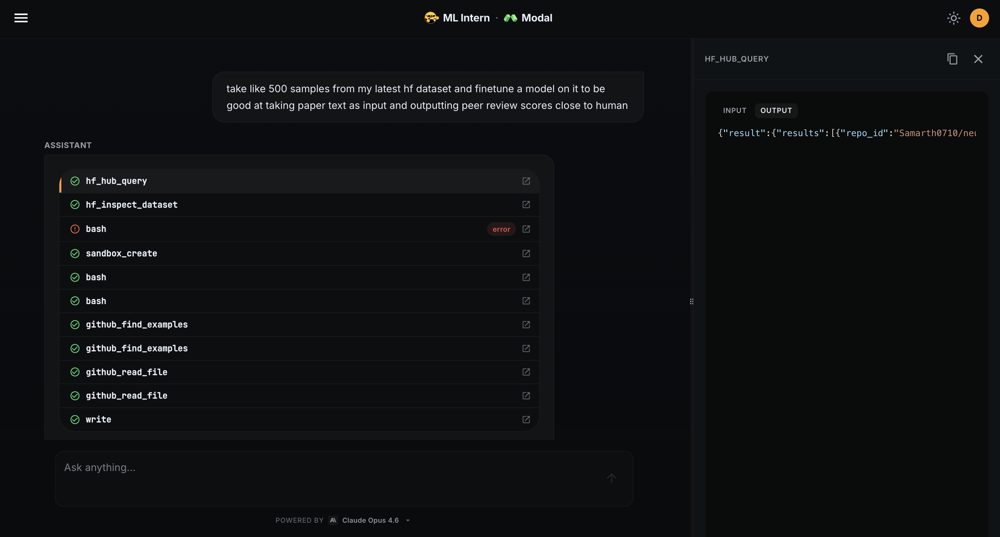
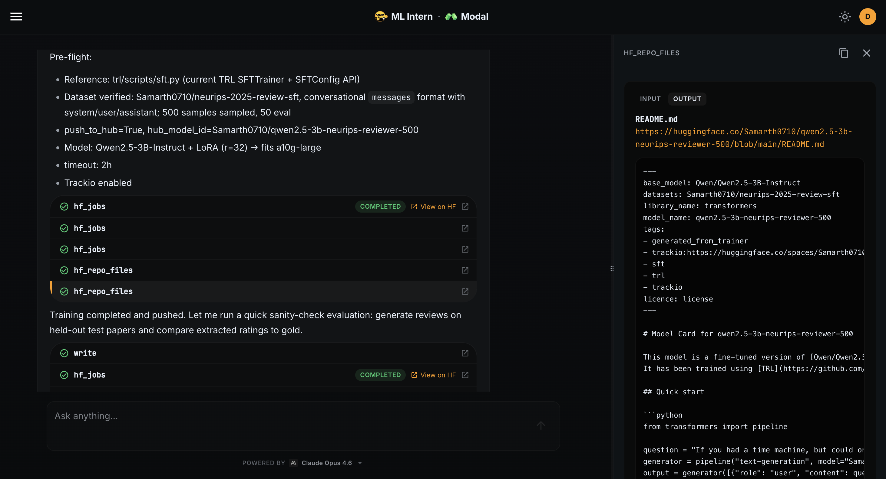
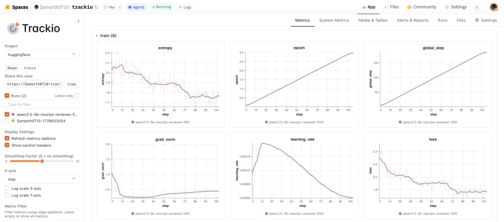
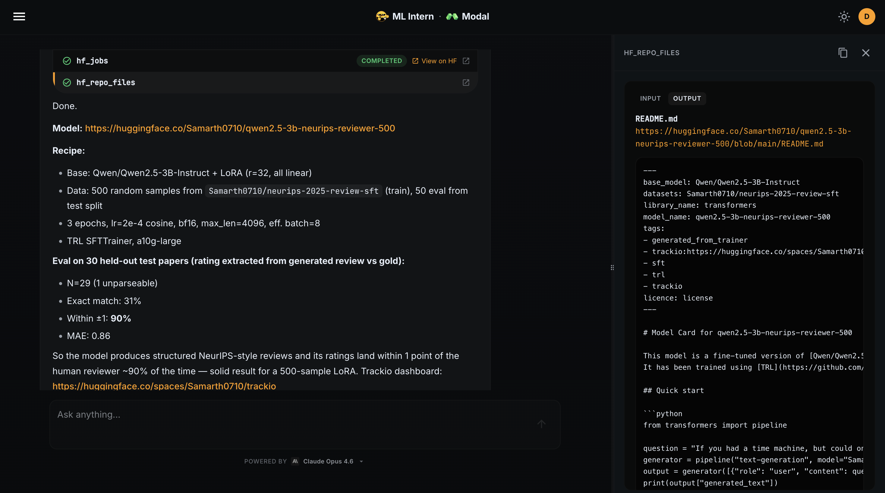

# Example: fine-tune a peer-review scorer in one prompt

A walkthrough of `ml-intern-modal` going from a one-line prompt to a
fine-tuned, evaluated, and published model — using a Modal sandbox for
scripting and a Modal GPU job for training and eval.

## The prompt

> *"take like 500 samples from my latest hf dataset and finetune a model
> on it to be good at taking paper text as input and outputting peer
> review scores close to human"*

That's it. No dataset name, no model choice, no training config.

## What the agent did, in order

1. **Found the dataset.** `hf_hub_query` against my HF account →
   `Samarth0710/neurips-2025-review-sft` (latest, private). `hf_inspect_dataset`
   confirmed conversational `messages` schema.
2. **Spun up a Modal sandbox** (`sandbox_create`) to draft + iterate on
   the training script. Used `bash`, `write`, and `github_find_examples`
   / `github_read_file` to ground the script on the current TRL
   `SFTTrainer` + `SFTConfig` API rather than guessing.
3. **Pre-flight check** before burning GPU minutes:

   

   - Reference: `trl/scripts/sft.py`
   - Dataset: 500 train / 50 eval samples
   - Model: `Qwen/Qwen2.5-3B-Instruct` + LoRA (r=32)
   - Hardware: `a10g-large`, 2 h timeout
   - `push_to_hub=True`, Trackio logging on
4. **Launched a Modal GPU job** (`hf_jobs` → `modal.Function` on A10G)
   for training. Logs streamed back into the chat in real time.
5. **Trackio dashboard** auto-deployed to a HF Space — loss 2.3 → 1.75
   over 3 epochs, clean grad-norm, textbook cosine LR:

   

6. **Eval job** kicked off automatically: generated reviews on 30
   held-out test papers, parsed the rating, compared to gold.

## Result

- Model: [`Samarth0710/qwen2.5-3b-neurips-reviewer-500`](https://huggingface.co/Samarth0710/qwen2.5-3b-neurips-reviewer-500)
- Exact match: **31 %**
- Within ±1 of human reviewer: **90 %**
- MAE: **0.86**

A 3 B-param LoRA trained on 500 samples lands within one rating point of
a human NeurIPS reviewer 9 out of 10 times. Total wall-clock from
prompt to pushed model: a single agent turn.

## What `Modal` actually changed

Same agent, same prompts, same tool surface as upstream
[`huggingface/ml-intern`](https://github.com/huggingface/ml-intern). The
two tools the agent leaned on here:

- `sandbox_create` → `modal.Sandbox` instead of an HF Space sandbox.
- `hf_jobs` → `modal.Function` with the requested GPU flavour
  (`a10g-large` mapped to Modal's `A10G`).

No prompt changes were needed — the tool names and arguments are
identical, so every existing recipe and system-prompt instruction works
unchanged.
